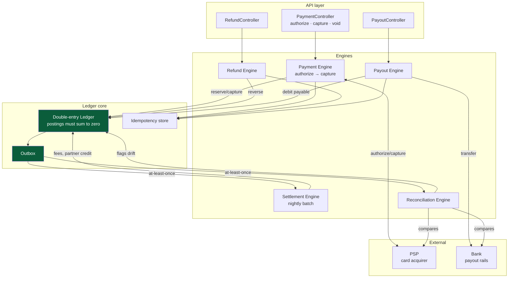

# TuTak Financial Core — design

Status: **built, on a sandbox acquirer.** All five phases exist and are
tested; what does not exist is a real PSP behind them.

| Phase | Status | Where |
| --- | --- | --- |
| 1 — Ledger, constraints, outbox | Built | `modules/ledger/` |
| 2 — Idempotency `IN_FLIGHT` | Built | `modules/ledger/idempotency.service.ts` |
| 3 — Payment engine | Built, sandbox PSP | `modules/payments/payment-engine.service.ts` |
| 4 — Settlement | Built | `modules/settlement/` |
| 5 — Refund, payout, reconciliation | Built | `modules/payments/refund-engine.service.ts`, `modules/payouts/`, `modules/reconciliation/` |

Two things in this document are still specification rather than code, and are
called out again where they appear below:

- **The acquirer.** Every payment runs against `SandboxPspAdapter`, a
  deterministic fake behind the `PspAdapter` interface. There is no acquirer
  contract, so there is no real adapter to write yet. The module refuses to
  boot the sandbox in production.
- **The phase-4 cut-over.** QR and EV redemption still use the pre-existing
  path and accrue bonus at their own completion, not through settlement. The
  new engines run alongside rather than underneath them. §9 describes that
  cut-over as the high-risk step it is; it has not been taken.

The existing `BonusLedgerEntry` handles loyalty points and does so correctly
(263 tests, property-based invariants). It is *not* a general ledger: it tracks
one asset, in one direction, for one party. Real money — customer charges,
partner balances, refunds, payouts — needs a different structure, and bolting
it onto the bonus ledger would corrupt both.

This design adds a double-entry ledger alongside the bonus ledger, and moves
the bonus ledger to post into it as one account class among several.

---

## 1. Why double entry

Single-entry records what happened to *one* account. Double entry records the
same event from both sides, and the requirement that they cancel is what makes
error detectable rather than merely undesirable.

The concrete failure single entry cannot catch: a partner is credited 9,500
for a 10,000 payment less a 500 fee. If the fee account is never debited, no
single-entry check notices — every individual row is well-formed. In double
entry the transaction does not balance and the write is refused.

The bonus engine already learned this lesson in miniature: entries carry
per-bucket deltas precisely so a wallet can be reconstructed. Double entry is
that idea applied across parties.

---

## 2. Architecture



Every arrow into `LED` is a database transaction. Every arrow out of `OUT` is
at-least-once and therefore must be idempotent at the consumer.

---

## 3. Chart of accounts

Five account types. `normalBalance` fixes the sign convention so a posting's
direction is unambiguous.

| Type | Normal | Owner | Meaning |
| --- | --- | --- | --- |
| `CUSTOMER_PAYABLE` | CREDIT | user | What TuTak owes a customer (prepaid balance, refunds due) |
| `PARTNER_PAYABLE` | CREDIT | partner | What TuTak owes a partner, pending payout |
| `PSP_RECEIVABLE` | DEBIT | — | Captured but not yet settled by the acquirer |
| `PLATFORM_REVENUE` | CREDIT | — | Commission retained |
| `BONUS_LIABILITY` | CREDIT | — | Outstanding loyalty points, valued at redemption cost |

A 10,000 AMD QR payment with a 3% commission and 500 points applied:

```
DR  PSP_RECEIVABLE        9 500      (cash the acquirer owes us)
DR  BONUS_LIABILITY         500      (points redeemed, liability released)
  CR  PARTNER_PAYABLE               9 700
  CR  PLATFORM_REVENUE                300
                        ------- -------
                         10 000  10 000
```

The accrual of new points is a separate, later posting — it is triggered by
settlement, not by capture, because points earned on a payment that is
subsequently charged back must never have been issued.

---

## 4. Schema

```prisma
enum LedgerAccountType {
  CUSTOMER_PAYABLE
  PARTNER_PAYABLE
  PSP_RECEIVABLE
  PLATFORM_REVENUE
  BONUS_LIABILITY
}

enum PostingDirection { DEBIT  CREDIT }

model LedgerAccount {
  id            String            @id @default(uuid())
  type          LedgerAccountType
  /// Exactly one of these is set, or neither for platform accounts.
  userId        String?
  partnerId     String?
  currency      Currency          @default(AMD)
  /// Materialized for reads; always rewritten in the same transaction as the
  /// postings that move it, exactly as Wallet is today.
  balance       Decimal           @default(0) @db.Decimal(18, 4)
  version       Int               @default(0)

  postings      LedgerPosting[]

  @@unique([type, userId, partnerId, currency])
  @@map("ledger_accounts")
}

/// A financial event. Its postings must sum to zero.
model LedgerTransaction {
  id             String   @id @default(uuid())
  /// Why this happened: PAYMENT_CAPTURE, REFUND, SETTLEMENT, PAYOUT, ...
  kind           String
  /// The domain row that caused it, for tracing back from accounting.
  sourceType     String
  sourceId       String
  /// Set once and never changed; a reversal is a new transaction that points
  /// at this one, never an edit.
  reversedById   String?  @unique
  postedAt       DateTime @default(now())

  postings       LedgerPosting[]

  @@index([sourceType, sourceId])
  @@index([postedAt])
  @@map("ledger_transactions")
}

model LedgerPosting {
  id            String           @id @default(uuid())
  transactionId String
  accountId     String
  direction     PostingDirection
  amount        Decimal          @db.Decimal(18, 4)
  currency      Currency         @default(AMD)

  transaction   LedgerTransaction @relation(fields: [transactionId], references: [id])
  account       LedgerAccount     @relation(fields: [accountId], references: [id])

  @@index([accountId, id])
  @@map("ledger_postings")
}
```

Payment, refund and payout each get a state machine table
(`Payment`, `Refund`, `Payout`) holding the PSP/bank reference, the current
status, and the `ledgerTransactionId` of the posting that recorded it.
Omitted here for length; each follows the same shape.

### Idempotency

```prisma
model IdempotencyKey {
  id            String   @id @default(uuid())
  /// Scoped per actor. A global key let one account replay another's — the
  /// mistake already made once on Transaction.idempotencyKey.
  scope         String
  key           String
  /// Hash of the request body. A repeat with the same key and a *different*
  /// body is a client bug and must 409, not silently return the first result.
  requestHash   String
  status        String   // IN_FLIGHT | COMPLETED
  responseBody  Json?
  createdAt     DateTime @default(now())

  @@unique([scope, key])
  @@map("idempotency_keys")
}
```

The `IN_FLIGHT` state is what makes this correct under concurrency: the second
caller finds the row, sees it in flight, and waits or 409s rather than starting
a parallel execution of the same operation.

### Outbox

```prisma
model OutboxEvent {
  id            String    @id @default(uuid())
  aggregateType String
  aggregateId   String
  eventType     String
  payload       Json
  /// Null until a consumer has processed it. Claimed with SKIP LOCKED so
  /// multiple workers can drain the table without duplicating work.
  processedAt   DateTime?
  attempts      Int       @default(0)
  nextAttemptAt DateTime  @default(now())
  lastError     String?
  createdAt     DateTime  @default(now())

  @@index([processedAt, nextAttemptAt])
  @@map("outbox_events")
}
```

Written **in the same transaction** as the ledger postings. That is the entire
point: an event exists if and only if the money moved.

---

## 5. Invariants

Enforced by database constraints, not convention:

1. **Every transaction balances.** `Σ debits = Σ credits` per
   `LedgerTransaction`, per currency. Deferred constraint trigger, checked at
   commit — postings are inserted one at a time, so it cannot be a row check.
2. **Postings are immutable.** `REVOKE UPDATE, DELETE ON ledger_postings`. A
   correction is a reversing transaction.
3. **Account balance equals its postings.** `balance = Σ(signed postings)`,
   asserted after every operation in tests, as `assertWalletIntegrity` does now.
4. **Amounts are strictly positive.** Direction carries the sign.
5. **No mixed currency within a transaction** until an explicit FX posting
   type exists.
6. **`PARTNER_PAYABLE` never negative** without an explicit clawback posting.

---

## 6. Engine behaviour

**Payment.** Two phases. `authorize` reserves funds at the PSP and posts
nothing — an authorization is not money. `capture` posts the transaction above
and emits `payment.captured`. Void before capture releases the PSP hold and
posts nothing.

**Settlement.** Consumes `payment.captured` from the outbox. Batches by
partner and day, produces a `Settlement` row, and *this* is where bonus accrual
fires — points earned on a payment that is later charged back were never
issued, rather than issued and clawed back.

**Refund.** Reverses the original transaction's postings into a new
transaction linked by `reversedById`. Full and partial. Reverses the associated
bonus accrual through the existing `reverseAccrualLot`, and reverses any
redemption through `reverseSettlement` — both already exist and are tested.

**Payout.** Debits `PARTNER_PAYABLE`, credits a bank-transfer clearing account,
emits `payout.requested`. The bank confirmation closes it. A payout is never
initiated for an amount exceeding the account balance, checked with a
conditional `updateMany` under `Serializable`.

**Reconciliation.** Nightly. Compares `PSP_RECEIVABLE` against the acquirer's
settlement file and `PARTNER_PAYABLE` against bank confirmations. Drift raises
a `FraudSignal` and blocks further payouts to the affected partner rather than
auto-correcting — a reconciliation engine that silently adjusts balances hides
the bug it exists to find.

---

## 7. API surface

Originally specified as a two-phase authorize/capture/void flow. **Built as
single-phase capture**, and the difference is worth stating rather than
quietly absorbing:

```
POST   /v1/payments                       { partnerId, amount, sourceToken, idempotencyKey }
GET    /v1/payments/:id                                          [owner or admin]
GET    /v1/payments/:id/refunds                                  [owner or admin]
POST   /v1/refunds                        { paymentId, amount?, reason, idempotencyKey }
                                                                 [PAYMENT_REFUND]
GET    /v1/payouts/partners/:id/balance                          [partner-scoped]
GET    /v1/payouts/partners/:id/settlements                      [partner-scoped]
GET    /v1/payouts/partners/:id                                  [partner-scoped]
POST   /v1/payouts                        { partnerId, amount, idempotencyKey }
                                                                 [PAYOUT_MANAGE]
POST   /v1/payouts/:id/confirm            { bankReference }      [PAYOUT_MANAGE]
POST   /v1/payouts/:id/fail               { failureReason }      [PAYOUT_MANAGE]
GET    /v1/admin/ledger/accounts                                 [LEDGER_READ]
GET    /v1/admin/ledger/accounts/:id/postings                    [LEDGER_READ]
GET    /v1/admin/reconciliation                                  [LEDGER_READ]
POST   /v1/admin/reconciliation/run       { periodStart, pspReceivable?, partnerPayables? }
                                                                 [LEDGER_READ]
POST   /v1/admin/partners/:id/payout-block/clear                 [PAYOUT_MANAGE]
```

Every mutating call takes `idempotencyKey` and is scoped per actor.

**Why single-phase.** A separate `authorize` earns its keep when the final
amount is not known when the customer commits — the EV case, where a session
is authorized for a ceiling and captured for what was actually drawn. QR
payments know the amount up front, so two phases would be ceremony. When EV
is routed through payments (the §9 phase-4 cut-over, not yet done), authorize
becomes necessary and should be added then, against a real acquirer that can
actually hold funds — a sandbox "authorization" proves nothing.

**Permissions.** Three were added rather than reusing `PARTNER_MANAGE`:
`PAYMENT_REFUND`, `PAYOUT_MANAGE`, `LEDGER_READ`. Editing a partner's
details, moving money back out of their balance, and wiring money to an
external bank are three different levels of trust. `PAYOUT_MANAGE` is
deliberately **not** granted to `ADMIN` — only `SUPER_ADMIN` — because a
payout is the least reversible action here and there is no maker-checker
flow yet to hand it out more widely.

---

## 8. Test plan

Mirrors the structure already proven in this repo: property-based invariants
after every operation, plus attacks written from the attacker's goal.

- **Invariants** — every transaction balances; account balance equals its
  postings; postings immutable under raw SQL; no negative payable.
- **Concurrency** — concurrent capture of one authorization (one wins);
  concurrent refund of one payment (total refunded never exceeds captured);
  concurrent payout draining one balance; outbox drained by two workers with
  `SKIP LOCKED` (each event processed once).
- **Rollback** — PSP timeout mid-capture; ledger write fails after PSP
  capture succeeds (the hard case: money moved externally, locally it did not);
  refund fails after bonus reversal.
- **Idempotency** — same key twice returns the first result; same key with a
  different body 409s; key replayed across actors is rejected.
- **Reconciliation** — injected drift is detected and blocks payouts.

Verification standard used throughout this project and to be kept: write the
attack, apply the fix, then **remove the fix and confirm the test fails.**

---

## 9. Migration plan

Five phases, each independently deployable and reversible.

| Phase | Content | Risk |
| --- | --- | --- |
| **1** | Ledger tables, constraints, outbox, idempotency store. No writers. | None — additive only |
| **2** | Outbox writer + drainer. Emit events, consume nothing. Validates delivery under real load before anything depends on it. | Low |
| **3** | Payment engine behind a feature flag, PSP sandbox only. Ledger postings written and reconciled, but QR flow still uses the old path. | Low — dual-write, old path authoritative |
| **4** | Cut over: QR and EV redemption require a captured payment. Re-enable `STATIC_MERCHANT`. Bonus accrual moves from capture to settlement. | **High** — the money path changes |
| **5** | Refunds, payouts, reconciliation. | Medium |

Phase 4 is the dangerous one and should run dual-write with reconciliation for
at least one full settlement cycle before the old path is removed.

The existing `BonusLedgerEntry` is **not** migrated. It keeps its own
invariants and gains a posting into `BONUS_LIABILITY` at accrual and
redemption. Two ledgers that agree is a reconciliation check; one rewritten
ledger is a rewrite of the only part of this system currently known to be
correct.

---

## 10. Build sequence

1. Phase 1 schema + constraints + the balancing trigger, with the invariant
   tests. Nothing else can be trusted until postings cannot fail to balance.
2. Outbox writer, drainer with `SKIP LOCKED`, retry with backoff, and the
   two-worker concurrency test.
3. Idempotency store with the `IN_FLIGHT` protocol and its concurrency test.
4. Payment engine against a PSP sandbox.
5. Settlement, then refund, then payout, then reconciliation.

Steps 1–3 are the foundation and are independent of which PSP is chosen —
they can start before the acquirer contract is signed. Step 4 cannot.

---

## 11. What was actually built, and what it cost

All five steps above exist. Where the implementation departed from this
specification, it was for a reason worth recording:

**Settlement posts a bonus liability.** The chart of accounts listed
`BONUS_LIABILITY` but no engine wrote to it. Issuing points is incurring a
debt — the platform owes that value at redemption — so settlement posts
`DR PLATFORM_REVENUE / CR BONUS_LIABILITY` alongside the bonus-ledger
accrual. Without it the double-entry ledger claimed the platform kept revenue
it had already committed to giving back.

**`BANK_CLEARING` was added to the chart of accounts.** A payout debits
`PARTNER_PAYABLE` and credits clearing, where the money sits until the bank
confirms. The alternative — straight out of the ledger on request — makes an
in-flight transfer invisible: not the partner's to request again, but not yet
safe to call gone either.

**Payouts serialize on `SELECT ... FOR UPDATE`, not a conditional UPDATE.**
The conditional-UPDATE pattern used everywhere else in this codebase does not
work here, because `ledger.post` moves the same balance the claim would move
— a claim that also moved it would double-count. Locking the row states the
intent (exclude concurrent readers) without touching the number.

**`reverseAccrualLot` gained an optional cap.** A partial refund must reclaim
a proportional share of the points, not all of them. The existing method took
the whole unspent remainder; it now takes `min(cap, remainder)`.

**Reconciliation runs today without any external statement.** Neither an
acquirer feed nor a bank feed exists. What it can do unaided — replay every
account against its own postings — is the check most worth running
unattended anyway, because it catches the ledger disagreeing with *itself*,
which is a bug in this codebase rather than a dispute with a third party.

### Test coverage against §8

| §8 requirement | Covered by |
| --- | --- |
| Every transaction balances | `ledger.int-spec.ts`, deferred constraint trigger |
| Balance equals its postings | `assertLedgerIntegrity` in refund/payout specs; `reconciliation.int-spec.ts` |
| Postings immutable | `ledger.int-spec.ts` |
| No over-refund under concurrency | `refund-engine.int-spec.ts`, plus a CHECK constraint |
| Concurrent payout drain | `payout-engine.int-spec.ts` |
| Outbox drained by two workers | `outbox.int-spec.ts` |
| Idempotency: replay, mismatch, per-actor | `idempotency.int-spec.ts` and each engine's spec |
| Injected drift blocks payouts | `reconciliation.int-spec.ts` |

### Not covered, and honestly so

- **Rollback after a successful external call.** §8 asks for "PSP timeout
  mid-capture" and "ledger write fails after PSP capture succeeds". The
  second is the genuinely hard case — money moved externally, locally it did
  not — and it is *not* solved here. `SandboxPspAdapter` can simulate an
  outage before capture (tested), but reconciling a real acquirer's captured
  charge against a missing local posting needs the acquirer's settlement
  file, which does not exist yet. This is the largest known gap in the
  financial core.
- **The phase-4 cut-over** (QR/EV redemption routed through payments) has
  not been done; §9 marks it high-risk and it needs the dual-write period it
  describes.
